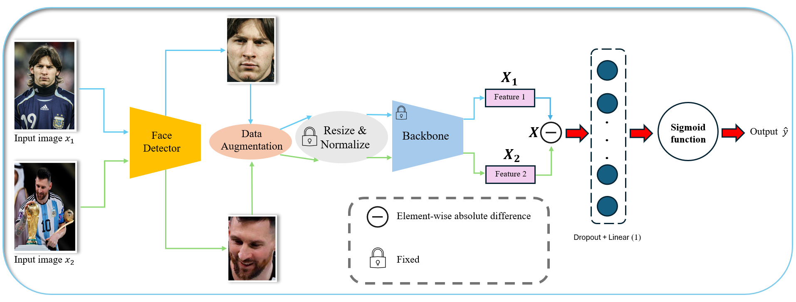

# Integrating YOLO with Siamese Neural Network based on FaceNet for Face Recognition
This repo utilizes **Siamese Neural Networks (SNNs) [1]** combined with **YOLO** to enhance the effectiveness of face recognition.

## Members
|      Name             |     Gmail                |
| :---------------:     | :--------:               |
| *Tien Quyet Le*       | *21520428@gm.uit.edu.vn*   |
| *Cong Nguyen Nguyen*  | *21521200@gm.uit.edu.vn*   |
## Table of Contents
* [Table of Contents](#table-of-contents)
* [Main Modules](#main-modules)
    + [Detector](#detector)
    + [Backbone](#backbone)
* [References](#references)
## Main Modules
### Detector
Before inputting the image into the FaceNet model, we deploy a detector to identify the location most likely to contain a face, specifically the **YOLOv5n** model. This process allows us to accurately determine the area where a face may appear, thereby enhancing the accuracy and reliability of the model.\
After identifying the face location, we will use this region as input for the FaceNet model instead of the original image. The YOLOv5n model has been further trained on the **Face-Detection-Dataset [2]** for a total of 30 epochs to significantly improve its face detection capabilities.
### Backbone
The backbone used in the model is **Inception-ResNet (v1)**, pre-trained on the **VGGFace2** dataset. To retain the features learned from this extensive dataset, the entire backbone will remain frozen during training. The model will only update the parameters of the added Linear layer (has Dropout layer before).
```python
from facenet_pytorch import InceptionResnetV1

model = InceptionResnetV1(pretrained="vggface2")
```
## References
[1] Gregory Koch, Richard Zemel, and Ruslan Salakhutdinov. Siamese
neural networks for one-shot image recognition. In ICML Deep Learning
Workshop, 2015.\
[2] Fares Elmenshawii. Face-detection-dataset. https://www.kaggle.com/datasets/fareselmenshawii/face-detection-dataset, 2023.